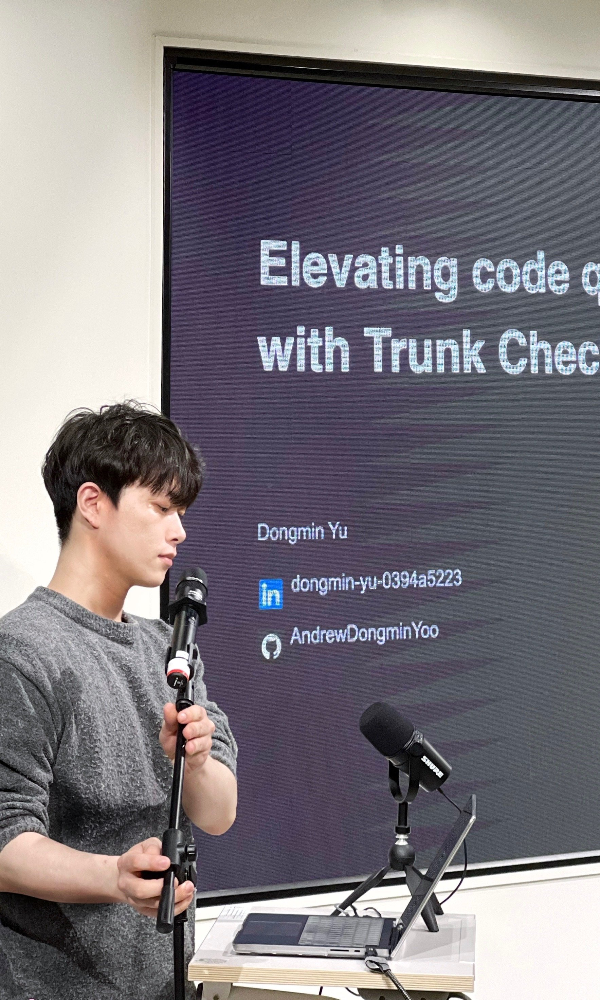

<h1> 안녕하세요, 크로스 플랫폼 앱 개발자 유동민입니다.  </h1>


[](https://www.linkedin.com/in/dongmin-yu-0394a5223/)
[](https://cat-minzzi.tistory.com/)
[](https://open.kakao.com/me/donminzzi)
[](https://medium.com/@donminzzi)

저는 주로 **Flutter**와 **React Native** 기반 크로스 플랫폼 앱 개발자로 활동하며, Python, TypeScript 등을 함께 다루고 있습니다.

### ✨ **저의 장점들**

-  **상용 앱 개발 및 출시 경험:** Flutter와 React Native를 이용한 상용 앱 개발 및 출시 경험 보유, App Store와 Google Play에 배포 및 운영을 통해 실제 사용자 경험과 피드백을 반영하여 지속적으로 제품 개선을 수행한 경험이 있습니다.
-  **클라우드 환경 설계 및 CI/CD 자동화:** AWS, GCP/Firebase, Supabase 등 다양한 클라우드 서비스를 활용해 크로스 플랫폼 앱의 백엔드를 구축하였고, 자동화된 빌드 및 배포 시스템 구축으로 서비스 안정성과 운영 효율을 높였습니다.
-  **제품 개발에 대한 열정 (사용자 중심적 사고):** 사용자 데이터를 기반으로 앱 UI를 개선하여, 사용자 이탈률을 감소시킨 경험이 있습니다. 고객과 직접 소통했던 외식업 경험을 바탕으로, 사용자 경험을 항상 제품 기획과 개발의 핵심으로 생각합니다.
-  **기술적 문제해결 능력:** 크로스 플랫폼 개발 과정에서 iOS/Android 특정 플랫폼 이슈를 디버깅하고 최적화하여, 메모리 누수 및 앱 크래시 문제를 해결한 경험이 다수 있습니다. Flutter, react-native에 오픈소스로 패키지를 만들어 배포한 경험이 다수 있습니다.
-  **요리사 출신의 기술적 연결성:** 요리사 시절, 해외 전문서적을 통해 기본기와 본질을 탐구했던 습관을 개발에서도 이어가고 있습니다. 공식 문서와 기술 원서를 깊게 이해하여 동료 개발자들이 신뢰하는 문서를 작성하며, 기술 공유 및 내부 컨퍼런스를 이끄는 역할을 해왔습니다.


### 📊 실시간 트래킹 코딩타임: (22.10.01.부터 기록 중)

[](https://wakatime.com/@9950e5aa-6874-4666-96a4-97dc4da0c644)

### 📊 주간 트래킹 코딩타임 (최근 7일간 통계)

<!--START_SECTION:waka-->

```txt
Dart          62 hrs 23 mins  █████████████████████▓░░░   86.52 %
Other         2 hrs 25 mins   █░░░░░░░░░░░░░░░░░░░░░░░░   03.36 %
Image (svg)   1 hr 53 mins    ▓░░░░░░░░░░░░░░░░░░░░░░░░   02.62 %
TypeScript    1 hr 43 mins    ▓░░░░░░░░░░░░░░░░░░░░░░░░   02.39 %
Bash          1 hr 37 mins    ▓░░░░░░░░░░░░░░░░░░░░░░░░   02.26 %
```

<!--END_SECTION:waka-->

<a href="https://github.com/AndrewDongminYoo/github-stats-transparent">


</a>
