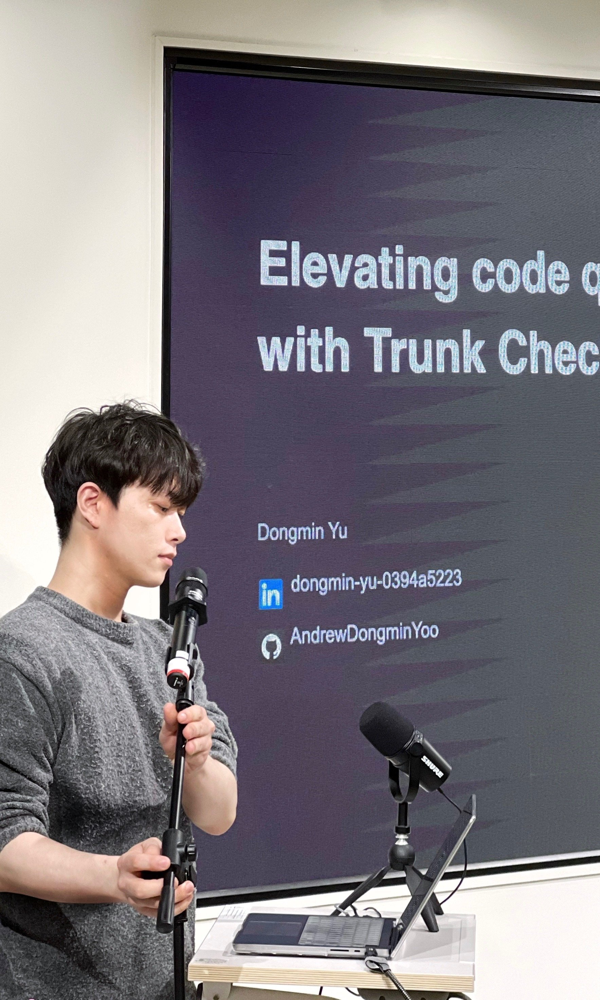

<h1> 안녕하세요, 크로스 플랫폼 앱 개발자 유동민입니다.  </h1>

크로스 플랫폼 모바일 개발자 · **Flutter** / **React Native** / **TypeScript** / **Python**

저는 주로 **Flutter**와 **React Native** 기반 크로스 플랫폼 앱 개발자로 활동하며, Python, TypeScript 등을 함께 다루고 있습니다.

## ✨ 저의 장점들

-  **상용 앱 개발 및 출시 경험:** Flutter·React Native 상용 앱을 App Store·Google Play에 배포·운영하며, 실제 사용자 피드백을 반영해 제품을 지속적으로 개선했습니다.
-  **Agentic Coding & 개발 하니스 구축:** Claude Code 기반 서브에이전트 오케스트레이션·커스텀 스킬·지식 하니스를 설계해 개발 워크플로우를 자동화하고, 그 접근을 프로덕트로 이어갑니다.
-  **클라우드 환경 설계 및 CI/CD 자동화:** AWS·GCP/Firebase·Supabase로 크로스 플랫폼 백엔드를 구축하고, 빌드·배포 자동화로 서비스 안정성과 운영 효율을 높였습니다.
-  **제품 개발에 대한 열정 (사용자 중심적 사고):** 사용자 데이터를 기반으로 UI를 개선하고, 외식업에서 고객과 직접 소통한 경험을 제품 기획·개발의 핵심으로 삼습니다.
-  **기술적 문제해결 능력:** iOS/Android 플랫폼 이슈를 디버깅·최적화해 메모리 누수와 크래시를 다수 해결했고, `react-native-naver-login`(New Architecture TurboModule) 등 오픈소스 패키지를 만들어 배포했습니다.
-  **요리사 출신의 기술적 연결성:** 요리사 시절 해외 원서로 기본기를 탐구하던 습관을 이어, 공식 문서와 기술 원서를 깊이 파고들고 그 이해를 오픈소스 문서화와 외부 개발자 밋업 발표로 공유해 왔습니다.

## 📊 코딩 활동 & 통계

**실시간 트래킹 코딩 타임** (2022.10.01.부터 기록 중)

**WakaTime 최근 7일 통계** — 갱신: [`AndrewDongminYoo/wakatime-svg`](https://github.com/AndrewDongminYoo/wakatime-svg)

**GitHub 컨트리뷰션 통계** — 갱신: [`AndrewDongminYoo/github-stats-transparent`](https://github.com/AndrewDongminYoo/github-stats-transparent)

